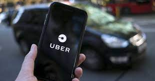

# Root Cause Analysis - Uber 

## Problem Statement
*Uber has received some complaints from their customers facing problems related to ride cancellations by the driver and non-availability of cars for a specific route in the city.* 

**Please Refer to the python Notebook for the solution to the Problem.**

# 🔗 Links

  

